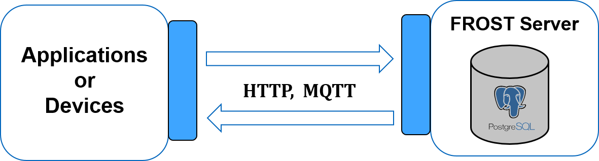

# FROST-Server
Due to the complete support of the OGC SensorThings API and Open Source in nature, we prefer to install and work with the FROST Server. The FROST Server extends PostgreSQL Database for supporting SensorThings API Data Model and allows inserting and querying data using HTTP operations (POST, GET, PATCH, and DELETE). The FROST-Server also supports MQTT protocol, which is an asynchronous communication protocol. It allows users to subscribe to real-time datastreams.

## Installation
The FROST-Server can be easily installed using Docker containers.

Step 1: Prepare docker-compose.yaml file

Step 2: Save docker-compose.yaml file in a folder.

Step 3: Go to the folder and run the command
docker-compose up -d

It will deploy the required containers (Tomcat and PostGIS instances for the FROST Server)

Considering the serviceRootUrl defined in the configuration file is http://localhost:8080/FROST-Server, the base resource path can be tested as http://localhost:8080/FROST-Server/v1.0/

It will return a JSON array of the available SensorThings resource endpoints as illustrated in the UML diagram.

## Setting up the FROST-Server
Once the FROST-Server is up and running, the sensor description and observations can be inserted using HTTP operations. The OGC SensorThings API data model is designed in such a way that the static information (e.g. sensor device description, location, and other metadata) and dynamic information (e.g. timeseries observations) are modeled separately. It allows us to insert static information only once and to insert dynamic information in real-time manner.

FROST-Server supports the following HTTP operations:
* GET - to retrieve
* POST
* PATCH
* DELETE

### Static Information
Step 1: Thing
A Thing is an object of the physical world (physical Things) or the information world (virtual Things) that is capable of being identified and integrated into communication networks.

Thing is a good starting point to start creating the SensorThings model structure. A Thing has Locations and one or more Datastreams to collect Observations. A minimal Thing can be created without a Location and Datastream and there are options to create a Things with a nested linked Location and Datastream.

Example 1: POST a Thing

    POST http://localhost:8080/FROST-Server/v1.0/Things
    Content-Type application/json

    {
      {
        "name": "my_thing",
        "description": "description_of_the_thing",
        "Locations": [
          {
            "name": "Munich, Germany",
            "encodingType": "application/vnd.geo+json",
            "description": "description_of_location",
            "location": {
              "coordinates":[11.49600700,48.11323500],
              "type":"Point"}
            }
        ]
      }
    }

Example 2: GET a Thing

    GET http://localhost:8080/FROST-Server/v1.0/Things

It will list all the registered Things in the FROST-Server. If the registered Thing ID is 1, it can be queried as

    GET http://localhost:8080/FROST-Server/v1.0/Things(1)

Example 3: PATCH

    PATCH http://localhost:8080/FROST-Server/v1.0/Things(1)
    Content-Type application/json
    {
      "description": "updated_description_of_the_thing"
    }

Example 4: DELETE

    DELETE http://localhost:8080/FROST-Server/v1.0/Things(1)

Step 2: ObservationProperty
An ObservedProperty specifies the phenomenon of an Observation. If the desired ObservedProperty is not registered already, it should be registered in the FROST-Server. In this scenario, if the Thing measures two ObservedProperties: Temperature and Humidity, they can be registered as follows:

Temperature

    POST http://localhost:8080/FROST-Server/v1.0/ObservedProperties
    Content-Type application/json
    {
      "name": "relative_humidity",
      "description": "https://en.wikipedia.org/wiki/Relative_humidity",
      "definition": "Percent"
    }

Relative Humidity

    POST http://localhost:8080/FROST-Server/v1.0/ObservedProperties
    Content-Type application/json
    {
      "name": "relative_humidity",
      "description": "https://en.wikipedia.org/wiki/Relative_humidity",
      "definition": "Percent"
    }

The registered ObservedProperties can be accessed using the GET operations

    GET http://localhost:8080/FROST-Server/v1.0/ObservedProperties - array of all registered ObservedProperties
    GET http://localhost:8080/FROST-Server/v1.0/ObservedProperties(1) - Temperature
    GET http://localhost:8080/FROST-Server/v1.0/ObservedProperties(2) - Relative Humidity

The PATCH and DELETE operations can be performed in the similar ways as described in the Things section.

Step 3: Sensors

A Sensor in SensorThings API is an instrument that observes a property or phenomenon with the goal of producing an estimate of the value of the property. If the desired Sensor is not registered already, it should be registered in the FROST-Server as follows:

    POST http://localhost:8080/FROST-Server/v1.0/Sensors
    Content-Type application/json
    {
      "name":"DHT22",
      "encodingType": "application/pdf",
      "metadata": "http://wiki.seeedstudio.com/Grove-Temperature_and_Humidity_Sensor_Pro/",
      "description": "http://wiki.seeedstudio.com/Grove-Temperature_and_Humidity_Sensor_Pro/"
    }

Once the sensor is registered, it can be accessed as follows:

    GET http://localhost:8080/FROST-Server/v1.0/Sensors - array of all registered sensors
    GET http://localhost:8080/FROST-Server/v1.0/ObservedProperties(1) - DHT22

Step 4: Datastreams

A Datastream groups a collection of Observations measuring the same ObservedProperty and produced by the same Sensor. In order to insert the Datastream, it is important to know the IDs of the Thing, the Sensor, and the ObservedProperty.

For example, the Datastream for the temperature property (ObservedProperty ID:1) being produced by the DHT22 sensor (Sensor ID:1) in the my_thing (Thing ID:1) can be registered as:

    POST http://localhost:8080/FROST-Server/v1.0/Datastreams
    Content-Type application/json
    {
      "name": "temperature",
      "unitOfMeasurement": {
        "name": "Celsius",
        "symbol": "C",
        "definition": "https://en.wikipedia.org/wiki/Celsius"
      },
      "Thing": {
        "@iot.id": 1
      },
      "description": "This is a datastream for the temperature property from my_thing",
      "Sensor": {
        "@iot.id": 1
      },
      "ObservedProperty": {
    	    "@iot.id": 1
      },
      "observationType": "http://www.opengis.net/def/observationType/OGC-OM/2.0/OM_Measurement"
    }

Similarly, the Datastream for the relative_humidity property (ObservedProperty ID:2) being produced by the DHT22 sensor (Sensor ID:1) in the my_thing (Thing ID:1) can be registered as:

    POST http://localhost:8080/FROST-Server/v1.0/Datastreams
    Content-Type application/json
    {
      "name": "temperature",
      "unitOfMeasurement": {
        "name": "Celsius",
        "symbol": "C",
        "definition": "https://en.wikipedia.org/wiki/Celsius"
      },
      "Thing": {
        "@iot.id": 1
      },
      "description": "This is a datastream for the relative_humidity property from my_thing",
      "Sensor": {
        "@iot.id": 1
      },
      "ObservedProperty": {
    	    "@iot.id": 2
      },
      "observationType": "http://www.opengis.net/def/observationType/OGC-OM/2.0/OM_Measurement"
    }

Once the sensor is registered, it can be accessed as follows:

    GET http://localhost:8080/FROST-Server/v1.0/Datastreams - array of all registered Datastreams
    GET http://localhost:8080/FROST-Server/v1.0/Datastreams(1) - temperature from my_thing
    GET http://localhost:8080/FROST-Server/v1.0/Datastreams(2) - relative_humidity from my_thing

### Dynamic information
Once the static information is registered at the FROST-Server with appropriate IDs, the dynamic information can be inserted corresponding to the relevant Datastream ID. For example, the temperature observations (time-value pairs) from the Iot Platform can be inserted to the FROST-Server against the respective Datastream ID.

For example, the timeseries of the temperature recordings of my_thing can be inserted corresponding to the Datastream ID 1 as follows:

    POST http://localhost:8080/FROST-Server/v1.0/Observations
    Content-Type application/json
    {
      "phenomenonTime": "2019-08-05T12:51:14+02:00",
      "result": 22.6,
      "Datastream": {
          "@iot.id": 1
      }
    }

For example, the timeseries of the temperature recordings of my_thing can be inserted corresponding to the Datastream ID 1 as follows:

    POST http://localhost:8080/FROST-Server/v1.0/Observations
    Content-Type application/json
    {
        "phenomenonTime": "2019-08-05T12:51:14+02:00",
        "result": 22.6,
        "Datastream": {
            "@iot.id": 2
        }
      }

The Observations for each of the Datastream can be accessed as follows:

    GET http://localhost:8080/FROST-Server/v1.0/Datastreams(1)/Observations - temperature from my_thing
    GET http://localhost:8080/FROST-Server/v1.0/Datastreams(2)/Observations - relative_humidity from my_thing

For more details, please visit https://github.com/FraunhoferIOSB/FROST-Server
