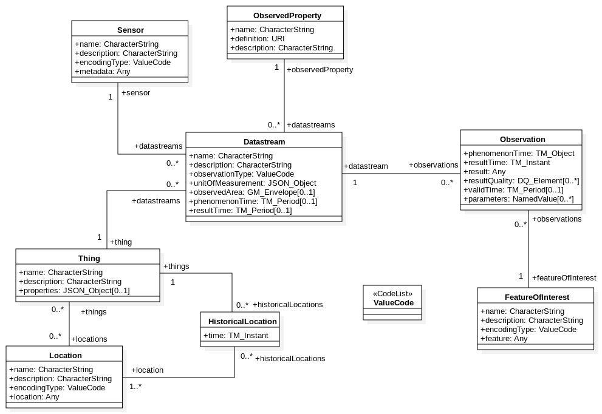
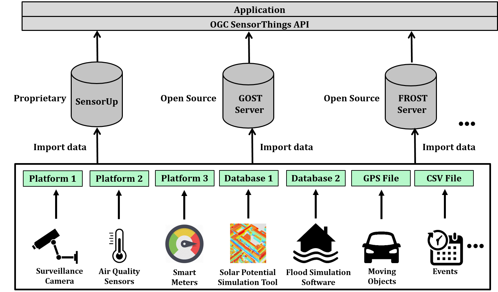

# OGC SensorThings API and the FROST Server

The OGC SensorThings API provides an open, geospatial-enabled and unified way to interconnect the Internet of Things (IoT) devices, data, and applications over the Web. The OGC SensorThings API is an open standard, and that means it is non-proprietary, platform-independent, and perpetual royalty-free. Although it is a new standard, it builds on a rich set of proven-working and widely-adopted open standards, such as the Web protocols and the OGC Sensor Web Enablement (SWE) standards, including the ISO/OGC Observation and Measurement (O&M) data model.

The main difference between the SensorThings API and the OGC Sensor Observation Service (SOS) is that the SensorThings API is designed specifically for the resource-constrained IoT devices and the Web developer community. As a result, the SensorThings API is lightweight and follows the REST principles, the use of an efficient JSON encoding, the use of MQTT protocol, the use of the flexible OASIS OData protocol and URL conventions.

## SensorThings API design
The following diagram is the UML Data Model for OGC SensorThings API and defining different entities and their properties, together with the relationship between entities.

SensorThings API defines the following resources. As SensorThings is a RESTful web service, each entity can be CREATE, READ, UPDATE, and DELETE with standard HTTP verbs (POST, GET, PATCH, and DELETE):

* Thing: An object of the physical world (physical things) or the information world (virtual things) that is capable of being identified and integrated into communication networks.
* Locations: Locates the Thing or the Things it associated with.
* HistoricalLocations: Set provides the current (i.e., last known) and previous locations of the Thing with their time.
* Datastream: A collection of Observations and the Observations in a Datastream measure the same ObservedProperty and are produced by the same Sensor.
* ObservedProperty : Specifies the phenomenon of an Observation.
* Sensor : An instrument that observes a property or phenomenon with the goal of producing an estimate of the value of the property.
* Observation: Act of measuring or otherwise determining the value of a property.
* FeatureOfInterest: An Observation results in a value being assigned to a phenomenon.The phenomenon is a property of a feature, the latter being the FeatureOfInterest of the Observation.

## SensorThings API Implementations
As shown, there are three major implementations of the OGC SensorThings API.

Name | License | Homepage | Short description
------------ | ------------- | ------------- | -------------
SensorUp | Proprietary | https://sensorup.com/ | SensorUp Inc. provides a complete implementation of the SensorThings API. It makes information from all different kinds of sensors accessible in a single platform, by using open standards to connect the sensors. Although this implementation is not open-source, SensorUp provides deployment platforms for testing and demonstration of the API. There is also a proposal from SensorThings API titled Whiskers, will be an open source Javascript client library for the OGC SensorThings API and a light-weight OGC SensorThings API server for IoT gateways (e.g., Raspberry Pi).
GOST Server | Open Source | https://www.gostserver.xyz/ | GOST is an OGC compliant implementation of the OGC SensorThings API written in Go Programmaing Language. However, as mentioned in their homepage, GOST is an alpha software and is not (yet) considered appropriate for customer use.  
FROST-Server | Open Source | https://github.com/FraunhoferIOSB/FROST-Server | The FRaunhofer Opensource SensorThings (FROST) Server is a server implementation of the OGC SensorThings API. It is the first complete, open-source implementation of the OGC SensorThings API Part 1: Sensing. It now also includes preliminary actuation support.

# Next: [Installation and setting up the FROST-Server](../FROST-Server/FROST.md)
