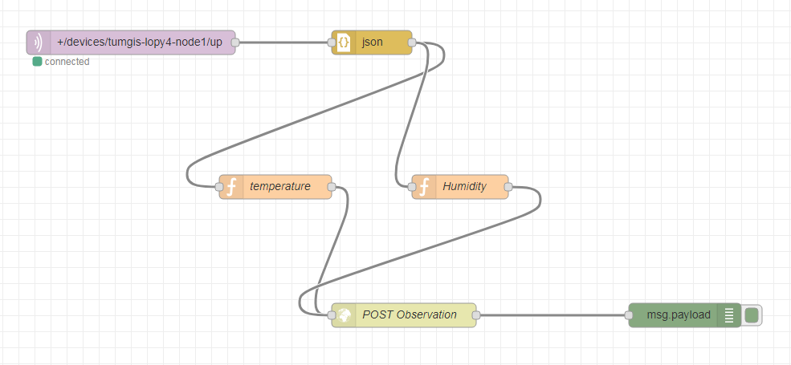

# Node-RED

Node-RED is a programming tool for wiring together hardware devices, APIs and online services. It provides a browser-based editor that makes it easy to wire together flows using the wide range of nodes in the palette that can be deployed to its runtime in a single-click.

## Installation
Node-RED can be installed very easily using Docker containers by using the below-mentioned steps. For more details about the installation steps, please visit https://github.com/node-red/node-red

To run this directly in docker at it's simplest just run

    docker run -it -p 1880:1880 --name mynodered nodered/node-red-docker

The coomand can be explained as follows:

    docker run      - run this container... and build locally if necessary first.
    -it             - attach a terminal session so we can see what is going on
    -p 1880:1880    - connect local port 1880 to the exposed internal port 1880
    --name mynodered - give this machine a friendly local name
    nodered/node-red-docker - the image to base it on the latest version

Once Node-RED is up and running, you can browse to http://localhost:1880 to interact with the application.

## Setting up the Node-RED Workbench

In this repository, we show an example of how the observations from a sensor device registered at the Things Network (TTN) can be imported to the FROST Server using a Node-RED Workbench in a real-time fashion. In the similar ways, observations can also be imported from other IoT platforms such as [Thingspeak](https://thingspeak.com/), [OpenSensors](https://www.opensensors.com/), and CSV files.

### IoT platform

This Node-RED workflow connects to a sensor device registered at The Things Network. The name of the device is *tumgis-lopy4-node1* with an attached DHT22 temperature/humidity sensor (more details, [here](https://wiki.tum.de/display/geosensorweb/LoRaWAN+Node+-+Pycom+LoPy4)). The frequency of the observations is every 5 minutes.

### Node-RED Workflow

This Node-RED workflow is developed in order to
* connect to the specific sensor device at the TTN,  
* retrieve the properties *temperature* and *humidity*,
* insert them to the FROST-Server.

**Step 1: MQTT Input**

The first step is to connect to the data source. In this case, the source is a sensor device registered at the TTN. Since TTN already supports MQTT protocol, we connect to this data source using MQTT Input Node. The advantage with the MQTT protocol is that it enables asynchronous communication protocol. we can subscribe to a particular stream and it will update us as soon as there is a new observation.

The connection properties can be provided as follows:

    Server : eu.thethings.netwrok  - This is the server name for TTN. Please also provide username and password.
    Topic : +/devices/tumgis-lopy4-node1/up  - It allows to retrieve all the observations from the mentioned device.

**Step 2: JSON Convertor**

It allows converting the observation string from the TTN to the JSON format. It allows querying and manipulating with individual properties and attributes of the observations.

**Step 3: Write Functions to read properties (temperature and humidity) and create InsertObservation requests for the FROST Server**

The next step is to write individual functions to read the properties from the TTN and creates InsertObservation request (like [this](../FROST-Server/FROST.md#dynamic-information)) in order to insert the observations to the FROST Server.

The function could look like this:

Temperature

    // Retrieve temperature value from the payload
    var tempValue = msg.payload.payload_fields.temperature.value;

    // Create a string to insert the result tot he FROST Server against a specific datastream.
    // This example assumes that the datastream for temperature property of this sensor device is 1.
    var newMessage =  { payload: {  "result": tempValue, "Datastream": {"@iot.id": 1}} };

    // Configure the Content-Type as json for the FROST Server
    newMessage.headers = {"Content-type" : "application/json"}

    return newMessage;

Humidity

    // Retrieve humidity value from the payload
    var humValue = msg.payload.payload_fields.humidity.value;

    // Create a string to insert the result tot he FROST Server against a specific datastream.
    // This example assumes that the datastream for humidity property of this sensor device is 2.
    var newMessage =  { payload: {  "result": humValue, "Datastream": {"@iot.id": 2}} };

    // Configure the Content-Type as json for the FROST Server
    newMessage.headers = {"Content-type" : "application/json"}

    return newMessage;

**Step 4: POST Observation**

The last step is to create an *http request* function and POST the observation to the FROST Server. The URL of the Observation can be

    http://localhost:8080/FROST-Server/v1.0/Observations

# Next: [Installation and setting up the Grafana Dashboards](../Grafana/README.md)
