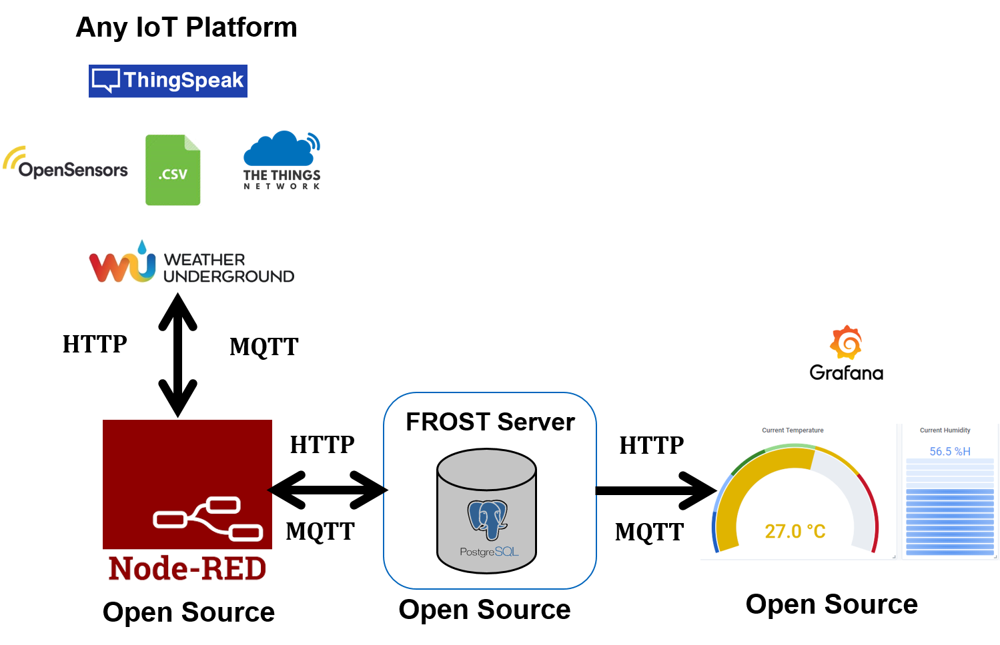

# Setting up IoT Ecosystem based on the Open Standards
Today, there are hundreds of millions of Internet-connected devices and sensors being used in applications ranging from Smart Cities, Digital Twins, Smart Homes, Smart Buildings, and so on. These sensors can be stationary such as Smart Meters measuring electricity consumption of a building and weather stations measuring outside temperature and humidity. Some of the sensors can also be non-stationary such as air-quality sensors mounted on a car measuring air pollution over different parts of a city at different time intervals. Since these sensors are heterogeneous in nature belonging to different stakeholders, encoded according to different APIs, they require interoperability in order to deal with all of them in unified ways. Such interoperability can be achieved by using open and international standards which, on the one hand, allow modeling and representing the data sources and, on the other hand, allow interfacing the distributed components that give access to data, visualizations, and analytical tools.

[Sensor Web Enablement (SWE)](https://www.mdpi.com/1424-8220/11/3/2652), an initiative from the Open Geospatial Consortium (OGC), has already developed a suite of standards enabling the discovery, access, tasking, as well as eventing and alerting of the sensor resources in a standardized way. The OGC SWE standards suite comprises well-defined information models such as (i) SensorML, which not only represents sensor description and metadata, but also sensor calibration records and accuracy and precision information, and (ii) Observations and Measurements (O&M) for describing real-time sensor observations. The SWE also provides comprehensive interface models and web services such as Sensor Observation Service (SOS) and SensorThings API for retrieval of sensor descriptions and observations with the help of standardized requests. In comparison to SOS, SensorThings API is a relatively new standard, which is REST-ful, lightweight, and based on JSON.

This repository explains step-by-step process to work with various IoT platforms and to manage and visualize their observations according to the OGC Sensor Web Enablement (SWE) standards. It describes various Open Source applications which are used to set up such OGC Standards based IoT ecosystem. By following the steps below, a user can very easily install and set up the required applications on his/her personal desktop/laptop or a remote (virtual) machine.

As a first example workflow, the repository demonstrates the ways to import real-time observations from the devices registered at [The Things Network (TTN)](https://www.thethingsnetwork.org/) platform. TTN is a new initiative which focuses on a technology called [LoRaWAN](https://www.thethingsnetwork.org/docs/lorawan/) allowing for things to talk to the Internet without 3G or WiFi, so no WiFi codes and mobile subscriptions are required. It features low battery usage, long range and low bandwidth, which is ideal for the IoT devices. The real-time observations are imported to the [FROST Server](https://github.com/FraunhoferIOSB/FROST-Server), which is an Open Source server implementation of the OGC SensorThings API. The import from TTN to the FROST Server is done by an Open Source software [NodeRED](https://nodered.org/). The sensor observations and locations are visualized on an Open Source Dashboard application [Grafana](https://grafana.com/). It allows performing sophisticated queries and visualizations using open and international standards. Similar workflows can also be created for other IoT platforms such as [Thingspeak](https://thingspeak.com/), [OpenSensors](https://www.opensensors.com/), and CSV files.

In order to install and set up the workflows, the following steps can be performed:

1. [Quick glance on the OGC SensorThings API](FROST-Server/README.md)
1. [Setting up the FROST Server](FROST-Server/FROST.md)
1. [Setting up the NodeRED Workbenches](NodeRED/README.md)
1. [Setting up the Grafana Dashboards](Grafana/README.md)
